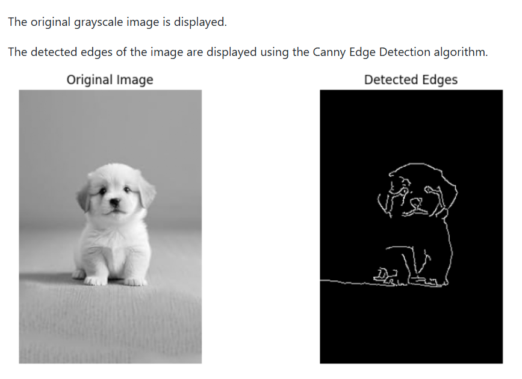

# WORKSHOP-3-Canny-Edge-Detection
# EDGE-DETECTION-USING-OPENCV

## Experiment No: 3

### Name:
Vimala Sahana W

### Register Number:
212223040241

# AIM:

To perform edge detection on an image using OpenCV techniques such as Gaussian Blur and Canny Edge Detection.

Software Required
Anaconda - Python 3.7
OpenCV
Matplotlib
Jupyter Notebook

## Algorithm:

Step 1:

Import the required libraries OpenCV and Matplotlib.

Step 2:

Read the input image dog.jpg in grayscale mode using OpenCV.

Step 3:

Apply Gaussian Blur to the image to reduce noise and smooth the image.

Step 4:

Apply Canny Edge Detection to detect the edges in the image.

Step 5:

Display the original grayscale image and the detected edge image using Matplotlib.

## PROGRAM:

Step 1: Import Required Libraries
```py
import cv2
import matplotlib.pyplot as plt

```
Step 2: Read the Input Image
```py
img = cv2.imread('dog.jpg', cv2.IMREAD_GRAYSCALE)
```
Step 3: Apply Gaussian Blur
```py
blurred = cv2.GaussianBlur(img, (5,5), 0)
```
Step 4: Perform Canny Edge Detection
```py
edges = cv2.Canny(blurred, 50, 150)
```
Step 5: Display the Images
```py
plt.figure(figsize=(10,5))

plt.subplot(121), plt.imshow(img, cmap='gray')
plt.title('Original Image')
plt.axis('off')

plt.subplot(122), plt.imshow(edges, cmap='gray')
plt.title('Detected Edges')
plt.axis('off')

plt.show()
```
## OUTPUT:
The original grayscale image is displayed.

The detected edges of the image are displayed using the Canny Edge Detection algorithm.



## RESULT:

Thus, edge detection was successfully performed on the input image using OpenCV and the edges were detected using the Canny Edge Detection technique.